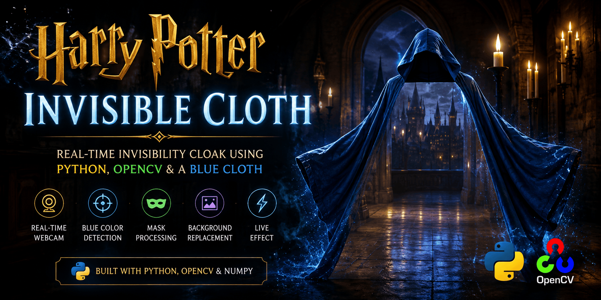

<p align="center">
  
</p>

<h1 align="center">
  🪄 Harry Potter Invisible Cloth
</h1>

<p align="center">
  <strong>A real-time computer vision project that creates a Harry Potter-style invisibility cloak effect using Python, OpenCV, a webcam, and a blue cloth — no green screen, no editing software, just clever image processing.</strong>
</p>

<p align="center">
  
  
  
</p>

<p align="center">
  
  
  
  
</p>

---

# 🪄 About

**Harry Potter Invisible Cloth** is a fun real-time computer vision project inspired by the magical invisibility cloak from the Harry Potter universe.

The project uses a webcam to detect a **blue cloth** and replaces the detected blue region with a previously captured background.

The result creates the illusion that the blue cloth has disappeared.

```text
🔵 Blue Cloth
      ↓
🎨 Detect Blue Color
      ↓
🎭 Create Mask
      ↓
🖼️ Replace With Background
      ↓
🪄 Invisible Cloth Effect
```

**No green screen. No Photoshop. No video editing. Just Python + OpenCV.**

> This is a fan-made computer vision project and is not affiliated with or endorsed by the Harry Potter franchise.

---

# ✨ Features

* 🪄 Harry Potter-style invisibility effect
* 📷 Real-time webcam processing
* 🔵 Blue cloth detection
* 🎨 HSV color segmentation
* 🎭 Binary mask generation
* 🧹 Morphological mask cleaning
* 🔄 Background replacement
* 🪞 Mirrored webcam view
* ⚡ Real-time frame processing
* 🐍 Python-based
* 👁️ OpenCV-powered
* 🔢 NumPy image processing
* 💻 Lightweight and beginner-friendly
* 🌍 Works with standard webcams

---

# 🎥 How It Works

The project follows a simple computer vision pipeline:

```text
📷 Webcam
   │
   ▼
🖼️ Capture Background
   │
   ▼
🎥 Capture Live Frame
   │
   ▼
🪞 Flip Frame Horizontally
   │
   ▼
🎨 BGR → HSV
   │
   ▼
🔵 Detect Blue
   │
   ▼
🎭 Create Mask
   │
   ▼
🧹 Clean Mask
   │
   ▼
🔄 Invert Mask
   │
   ▼
🖼️ Extract Background
   │
   ▼
🎥 Extract Live Frame
   │
   ▼
✨ Combine Both
   │
   ▼
🪄 Invisible Cloth
```

---

# 🧠 How the Magic Works

## 01 · Capture the Background

When the program starts, it waits for the webcam and captures multiple frames.

```python
for i in range(30):
    ret, background = cap.read()
```

The captured frame becomes the **background image**.

The camera should remain stationary after this step.

---

## 02 · Capture the Live Frame

The program continuously reads frames from the webcam:

```python
ret, img = cap.read()
```

Each frame is processed in real time.

---

## 03 · Convert BGR to HSV

OpenCV normally uses BGR color format.

The frame is converted to HSV:

```python
hsv = cv2.cvtColor(img, cv2.COLOR_BGR2HSV)
```

HSV makes color-based detection easier because color information is separated into:

* Hue
* Saturation
* Value

---

## 04 · Detect the Blue Cloth

The project uses an HSV range for blue:

```python
lower_blue = np.array([90, 80, 80])
upper_blue = np.array([130, 255, 255])
```

The blue region is detected using:

```python
mask = cv2.inRange(
    hsv,
    lower_blue,
    upper_blue
)
```

The result is a binary mask:

```text
White  → Blue region
Black  → Everything else
```

---

## 05 · Clean the Mask

The mask can contain small unwanted areas.

Morphological operations are used to clean it:

```python
kernel = np.ones((3, 3), np.uint8)

mask = cv2.morphologyEx(
    mask,
    cv2.MORPH_OPEN,
    kernel
)

mask = cv2.morphologyEx(
    mask,
    cv2.MORPH_DILATE,
    kernel
)
```

This helps produce a cleaner invisibility effect.

---

## 06 · Invert the Mask

The mask is inverted:

```python
mask_inv = cv2.bitwise_not(mask)
```

Now the program has two regions:

```text
🔵 Blue Region
      ↓
Captured Background

👤 Non-Blue Region
      ↓
Live Camera Frame
```

---

## 07 · Replace the Cloth

The background is extracted using the blue mask:

```python
background_part = cv2.bitwise_and(
    background,
    background,
    mask=mask
)
```

The current live frame is extracted using the inverted mask:

```python
current_part = cv2.bitwise_and(
    img,
    img,
    mask=mask_inv
)
```

The two images are then combined:

```python
final_output = cv2.addWeighted(
    background_part,
    1,
    current_part,
    1,
    0
)
```

The blue cloth is now replaced with the background.

✨ **Magic!**

---

# 🎯 The Illusion

The project doesn't actually make the cloth invisible.

It creates the illusion by replacing the blue pixels with pixels from the background.

```text
        BEFORE

      👤 Person
      🔵 Blue Cloth
           │
           ▼
      Color Detection
           │
           ▼
       Blue Mask
           │
           ▼
     Background Image
           │
           ▼

        AFTER

      👤 Person
      🪄 Invisible
```

---

# 🛠️ Built With

* 🐍 **Python**
* 👁️ **OpenCV**
* 🔢 **NumPy**
* 📷 **Webcam**
* 🎨 **HSV Color Space**
* 🎭 **Binary Masks**
* 🧹 **Morphological Operations**
* 🖼️ **Image Compositing**

---

# 📦 Requirements

Before running the project, make sure you have:

* Python 3.x
* A working webcam
* A blue cloth
* OpenCV
* NumPy

Install the dependencies:

```bash
pip install opencv-python numpy
```

---

# 🚀 Run Locally

Clone the repository:

```bash
git clone https://github.com/AmitDas4321/Harry-Potter-Invisible-Cloth.git
```

Enter the project directory:

```bash
cd Harry-Potter-Invisible-Cloth
```

Install dependencies:

```bash
pip install -r requirements.txt
```

Run the application:

```bash
python main.py
```

The webcam window will open automatically.

Press:

```text
Q
```

to close the application.

---

# 📁 Project Structure

```text
Harry-Potter-Invisible-Cloth/
│
├── main.py
├── requirements.txt
├── README.md
│
└── assets/
    └── img/
        └── banner.png
```

### `main.py`

Contains the complete real-time computer vision implementation.

### `requirements.txt`

Contains the required Python packages:

```text
opencv-python
numpy
```

---

# 🎯 How To Use

Follow these steps for the best result:

### 1. Start the program

```bash
python main.py
```

### 2. Stay out of the camera view

The program will capture the background for a few moments.

### 3. Keep the camera still

Do not move the webcam after the background has been captured.

### 4. Enter with the blue cloth

Hold or wear the blue cloth.

### 5. Watch the magic happen

The blue area will be replaced by the captured background.

### 6. Press `Q`

Press **Q** to exit.

---

# 💡 Tips for Better Results

For a cleaner invisibility effect:

* 🔵 Use a bright blue cloth.
* 📷 Keep the webcam completely stationary.
* 💡 Use consistent lighting.
* 🌑 Avoid strong shadows.
* 🔵 Keep other blue objects away from the background.
* 🖼️ Capture a clean background before entering the frame.
* 👕 Make sure the blue cloth is clearly visible.
* 🚫 Avoid moving the camera.
* 🚫 Avoid extremely dark environments.

---

# 🎨 Blue Detection Settings

The current HSV detection range is:

```python
lower_blue = np.array([90, 80, 80])
upper_blue = np.array([130, 255, 255])
```

If your blue cloth isn't detected correctly, you can adjust these values depending on:

* Lighting
* Cloth color
* Camera quality
* Indoor/outdoor environment

Different shades of blue may require different HSV ranges.

---

# 💡 What You Can Learn

This project is a great introduction to real-time computer vision.

By exploring this project, you can learn:

* OpenCV fundamentals
* Webcam capture
* BGR color space
* HSV color space
* Color segmentation
* Binary masks
* Mask inversion
* Bitwise operations
* Morphological image processing
* Background replacement
* NumPy image manipulation
* Real-time video processing

---

# 🚀 Future Improvements

Possible future upgrades include:

* 🎨 Support multiple cloak colors
* 🎯 Automatic HSV calibration
* 🎛️ Live HSV controls
* ✨ Better edge smoothing
* 🧠 AI-based person segmentation
* 🧍 Advanced person detection
* 🎥 Video recording
* 📊 Real-time FPS counter
* 🔄 Automatic background refresh
* 🖥️ GUI controls
* 🌈 Dynamic background replacement
* ✨ More realistic cloak edges

---

# ❤️ Why This Project?

Computer vision can turn simple ideas into something that feels like magic.

This project takes a basic concept from the Harry Potter universe and recreates the illusion using fundamental image-processing techniques.

It demonstrates that you don't always need complex AI models to create impressive visual effects.

Sometimes all you need is:

**A webcam.
A blue cloth.
A little Python.
And some computer vision magic.**

🪄 **The magic is in the pixels.**

---

# 👨‍💻 Author

<p align="center">
  <a href="https://github.com/AmitDas4321">
    
  </a>
</p>

<p align="center">
  <b>Amit Das</b><br>
  Full Stack Developer & Computer Vision Enthusiast
</p>

<p align="center">
  <a href="https://github.com/AmitDas4321">
    
  </a>
</p>

---

# ⭐ Support

If you enjoyed this project or found it useful, consider giving the repository a ⭐ on GitHub.

Your support helps motivate more creative open-source experiments with Python and computer vision.

---

# 📜 License

This project is licensed under the **MIT License**.

---

<p align="center">

### 🪄

*"Any sufficiently advanced technology is indistinguishable from magic."*

</p>

---

<p align="center">
  <b>Made with ❤️ by <a href="https://amitdas.site">Amit Das</a></b><br>
  ☕ Support development: <a href="https://buymeacoffee.com/amitdas4321">Buy Me a Coffee</a>
</p>